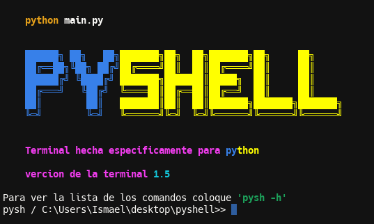
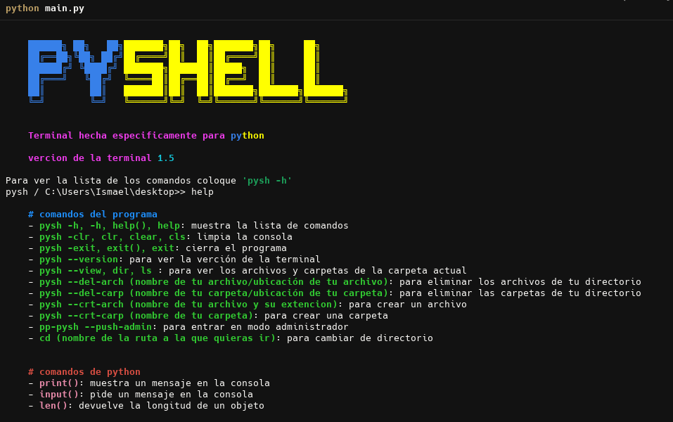

# 🐍 Pyshell

**Pyshell** es una terminal personalizada pensada especialmente para programadores en Python. Su objetivo es ofrecer una experiencia cómoda, fluida y adaptable para quienes trabajan constantemente con este lenguaje.  
La terminal **Pyshell** está en constante evolución, con actualizaciones regulares para mejorar su rendimiento, funcionalidad y experiencia de usuario.

---

## ✨ Características

- Entorno amigable y diseñado específicamente para desarrolladores Python.
- Interfaz minimalista y funcional.
- Compatible con múltiples versiones de Python.
- Soporte para comandos personalizados.
- Sistema modular, fácil de extender.
- Respuestas interactivas y mensajes enriquecidos.

---

## 🐍 Imagenes de la terminal de PYSHELL 


---

## 🚧 En desarrollo

Este proyecto está en fase activa de desarrollo. Se añadirán nuevas funciones con el tiempo, como:

- Integración con librerías populares (como `pip`).
- Historial de comandos y scripts recientes.
- Sistema de plugins.
- Mejoras visuales y soporte multiplataforma.

---

## 📥 Instalación

> Requisitos: Python 3.7 o superior

```bash
git clone https://github.com/ismaelhtmljs/Pyshell
cd pyshell
python main.py
